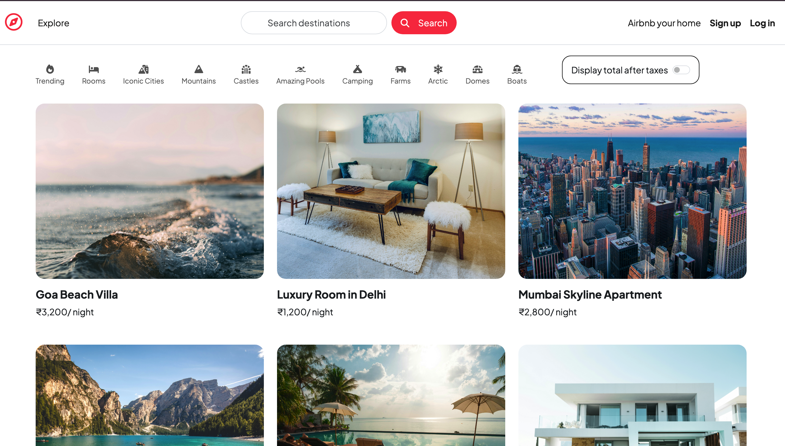
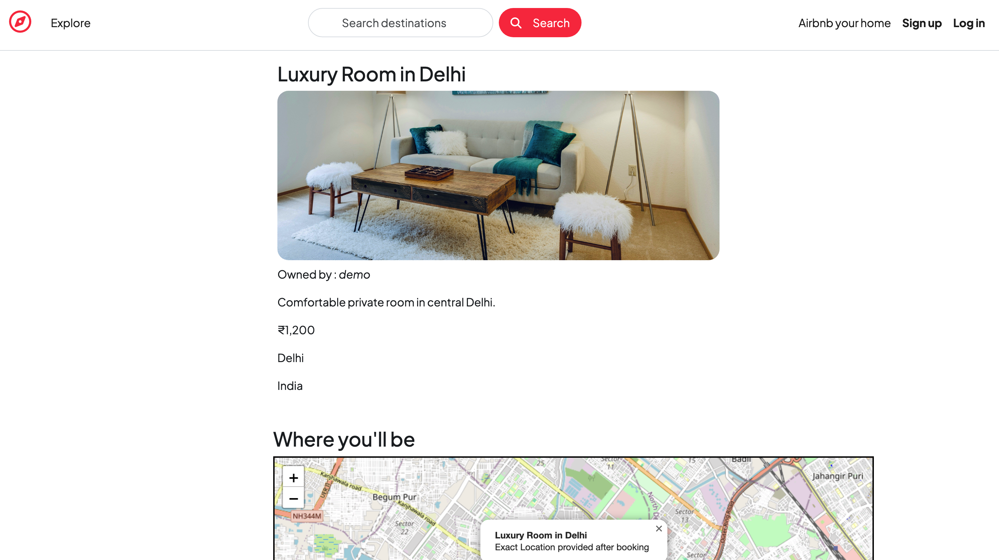

# 🌍 Wanderlust – Travel Listing Web App

Wanderlust is a full-stack web application where users can explore travel listings, create their own listings, and manage them easily.
It is inspired by platforms like Airbnb and built using **Node.js, Express, MongoDB, and EJS**.

---

## 🚀 Features

* 🏡 View all travel listings
* ➕ Create new listings
* ✏️ Edit and update listings
* ❌ Delete listings
* 🖼 Upload images using **Multer + Cloudinary**
* 🔐 User authentication and authorization
* 🗂 Category filters (Trending, Mountains, Rooms, Camping, etc.)
* 🗺 Map integration using **Leaflet + OpenStreetMap**
* 💰 Price display with optional tax toggle
* 📱 Responsive UI using **Bootstrap**

---

## 🛠 Tech Stack

**Frontend**

* HTML
* CSS
* Bootstrap
* EJS (Embedded JavaScript)

**Backend**

* Node.js
* Express.js

**Database**

* MongoDB
* Mongoose

**Other Tools**

* Cloudinary (Image Storage)
* Multer (File Upload)
* Leaflet + OpenStreetMap (Maps)

---

## 📂 Project Structure

```
MAJORPROJECT
│
├── models
│   └── listing.js
│
├── routes
│   └── listing.js
│
├── controllers
│   └── listing.js
│
├── views
│   ├── layouts
│   └── listings
│
├── init
│   ├── data.js
│   └── index.js
│
├── public
│
├── app.js
└── README.md
```

---

## ⚙️ Installation

Clone the repository

```
git clone https://github.com/yourusername/wanderlust.git
```

Go to project folder

```
cd wanderlust
```

Install dependencies

```
npm install
```

Start MongoDB and run the project

```
nodemon app.js
```

---

## 🗄 Database Initialization

To load sample listings into the database run:

```
node init/index.js
```

This will insert multiple travel listings into MongoDB.

---

## 📸 Screenshots

### 🏠 Home Page


### 📍 Listings


## 🌟 Future Improvements

* Booking system
* Search functionality
* Payment integration

---

## 🚀 Live Demo

🔗 **Click here to view the project:**  
👉 [Wanderlust Live](https://major-project-u9lj.onrender.com/listings)

## 👩‍💻 Author

**Shanvi Kesarwani**

---

⭐ If you like this project, consider giving it a star on GitHub!
